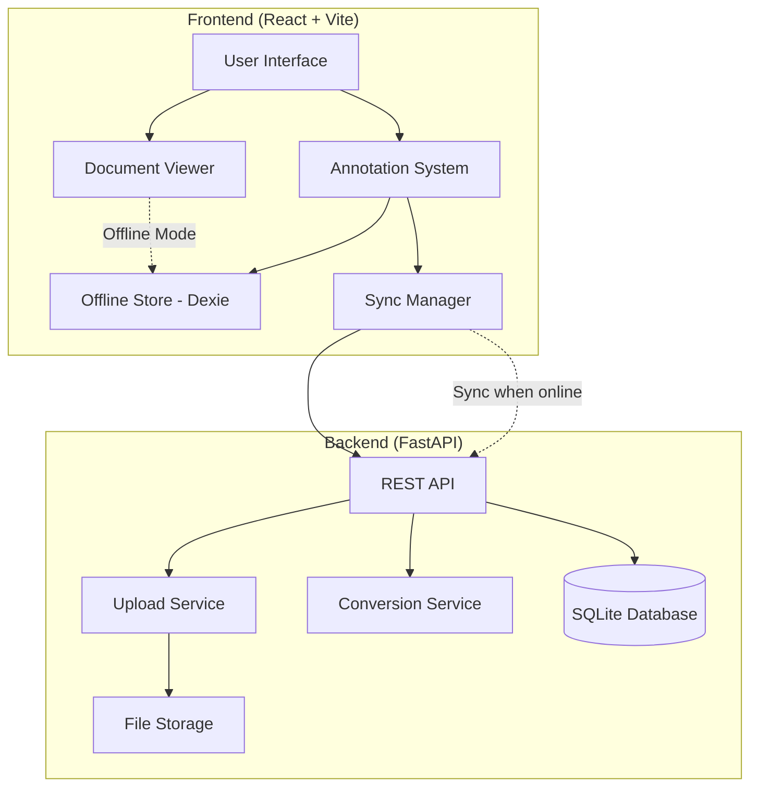

# Design Document

## Overview

The Document Annotation System is built as a full-stack web application with a React + Vite frontend and FastAPI backend. The architecture follows an offline-first approach using IndexedDB for local persistence and SQLite for server-side storage. The system supports multiple document formats through conversion pipelines and provides real-time annotation capabilities with smooth user interactions.

## Architecture

### High-Level Architecture



### Technology Stack

**Frontend:**
- React 18 with TypeScript
- Vite for build tooling
- Tailwind CSS for styling
- Framer Motion for animations
- PDF.js for PDF rendering
- react-zoom-pan-pinch for image viewing
- Dexie.js for IndexedDB management

**Backend:**
- FastAPI with Python 3.9+
- SQLAlchemy for ORM
- Pydantic for data validation
- SQLite for database
- LibreOffice headless for document conversion
- Uvicorn for ASGI server

## Components and Interfaces

### Frontend Components

#### 1. Document Viewer (`DocumentViewer.tsx`)
```typescript
interface DocumentViewerProps {
  documentId: string;
  documentType: 'pdf' | 'image' | 'docx';
  documentUrl: string;
}

interface ViewerState {
  currentPage: number;
  zoomScale: number;
  panOffset: { x: number; y: number };
  isLoading: boolean;
}
```

**Responsibilities:**
- Render documents based on MIME type
- Handle zoom and pan interactions
- Manage viewport state
- Coordinate with annotation overlay

#### 2. Annotation System (`AnnotationOverlay.tsx`)
```typescript
interface Annotation {
  id: string;
  documentId: string;
  page: number;
  xPercent: number;
  yPercent: number;
  content: string;
  createdAt: Date;
  updatedAt: Date;
}

interface AnnotationOverlayProps {
  documentId: string;
  currentPage: number;
  viewerState: ViewerState;
  onAnnotationCreate: (annotation: Omit<Annotation, 'id' | 'createdAt' | 'updatedAt'>) => void;
}
```

**Responsibilities:**
- Capture click events for annotation creation
- Render pinpoint markers
- Handle annotation editing and deletion
- Maintain coordinate transformations

#### 3. Notes Panel (`NotesPanel.tsx`)
```typescript
interface NotesPanelProps {
  documentId: string;
  currentPage: number;
  annotations: Annotation[];
  onAnnotationSelect: (annotation: Annotation) => void;
  onAnnotationEdit: (id: string, content: string) => void;
  onAnnotationDelete: (id: string) => void;
}
```

**Responsibilities:**
- Display annotation list for current page
- Provide annotation management interface
- Handle navigation to annotation locations

#### 4. Upload Interface (`FileUpload.tsx`)
```typescript
interface FileUploadProps {
  onUploadSuccess: (document: DocumentMetadata) => void;
  onUploadError: (error: string) => void;
}

interface DocumentMetadata {
  id: string;
  filename: string;
  mimeType: string;
  size: number;
  uploadedAt: Date;
  convertedPath?: string;
}
```

**Responsibilities:**
- Handle drag-and-drop file uploads
- Display upload progress
- Validate file types and sizes
- Trigger document conversion workflow

### Backend API Endpoints

#### Document Management
```python
# Upload endpoint
POST /api/upload
Content-Type: multipart/form-data
Response: DocumentMetadata

# Get document metadata
GET /api/documents/{document_id}
Response: DocumentMetadata

# Get document file
GET /api/documents/{document_id}/file
Response: File stream

# Health check
GET /api/health
Response: {"status": "healthy"}
```

#### Annotation Management
```python
# Get annotations for document
GET /api/annotations/{document_id}
Query: ?page=1
Response: List[Annotation]

# Create annotation
POST /api/annotations
Body: CreateAnnotationRequest
Response: Annotation

# Update annotation
PUT /api/annotations/{annotation_id}
Body: UpdateAnnotationRequest
Response: Annotation

# Delete annotation
DELETE /api/annotations/{annotation_id}
Response: {"success": true}
```

## Data Models

### Database Schema

#### Documents Table
```sql
CREATE TABLE documents (
    id VARCHAR(36) PRIMARY KEY,
    filename VARCHAR(255) NOT NULL,
    original_filename VARCHAR(255) NOT NULL,
    mime_type VARCHAR(100) NOT NULL,
    file_size INTEGER NOT NULL,
    file_path VARCHAR(500) NOT NULL,
    converted_path VARCHAR(500),
    created_at TIMESTAMP DEFAULT CURRENT_TIMESTAMP,
    updated_at TIMESTAMP DEFAULT CURRENT_TIMESTAMP
);
```

#### Annotations Table
```sql
CREATE TABLE annotations (
    id VARCHAR(36) PRIMARY KEY,
    document_id VARCHAR(36) NOT NULL,
    page INTEGER NOT NULL,
    x_percent DECIMAL(5,2) NOT NULL,
    y_percent DECIMAL(5,2) NOT NULL,
    content TEXT NOT NULL,
    created_at TIMESTAMP DEFAULT CURRENT_TIMESTAMP,
    updated_at TIMESTAMP DEFAULT CURRENT_TIMESTAMP,
    FOREIGN KEY (document_id) REFERENCES documents(id) ON DELETE CASCADE
);
```

### IndexedDB Schema (Dexie)
```typescript
class AnnotationDatabase extends Dexie {
  documents!: Table<DocumentMetadata>;
  annotations!: Table<Annotation>;

  constructor() {
    super('AnnotationDatabase');
    this.version(1).stores({
      documents: 'id, filename, mimeType, uploadedAt',
      annotations: 'id, documentId, page, [documentId+page], createdAt'
    });
  }
}
```

## Error Handling

### Frontend Error Boundaries
```typescript
interface ErrorBoundaryState {
  hasError: boolean;
  error?: Error;
  errorInfo?: ErrorInfo;
}

class DocumentViewerErrorBoundary extends Component<Props, ErrorBoundaryState> {
  // Handle PDF.js errors, annotation system errors, and network failures
}
```

### Backend Error Responses
```python
class APIError(Exception):
    def __init__(self, status_code: int, message: str, details: dict = None):
        self.status_code = status_code
        self.message = message
        self.details = details or {}

# Error response format
{
    "error": {
        "code": "INVALID_FILE_TYPE",
        "message": "Unsupported file format",
        "details": {"supported_types": ["pdf", "doc", "docx", "png", "jpg", "jpeg"]}
    }
}
```

### Offline Handling Strategy
1. **Network Detection**: Use `navigator.onLine` and periodic connectivity checks
2. **Queue Management**: Store failed sync operations in IndexedDB queue
3. **Retry Logic**: Exponential backoff with maximum retry attempts
4. **User Feedback**: Clear indicators of online/offline status and sync state

## Testing Strategy

### Frontend Testing
- **Unit Tests**: Jest + React Testing Library for components
- **Integration Tests**: Cypress for user workflows
- **Performance Tests**: Lighthouse CI for rendering performance
- **Accessibility Tests**: axe-core integration

### Backend Testing
- **Unit Tests**: pytest for API endpoints and business logic
- **Integration Tests**: TestClient for full request/response cycles
- **Database Tests**: In-memory SQLite for data layer testing
- **File Processing Tests**: Mock LibreOffice conversion pipeline

### Key Test Scenarios
1. **Upload Flow**: File validation → conversion → storage → metadata persistence
2. **Annotation Lifecycle**: Create → edit → delete → sync → offline persistence
3. **Viewer Interactions**: Zoom → pan → coordinate transformation → annotation positioning
4. **Offline Scenarios**: Network disconnection → local operations → sync recovery
5. **Error Conditions**: Invalid files → conversion failures → database errors

## Performance Considerations

### Frontend Optimizations
- **Lazy Loading**: Load PDF pages on-demand
- **Virtual Scrolling**: For large annotation lists
- **Debounced Sync**: Batch annotation updates
- **Canvas Optimization**: Efficient redraw cycles for annotations
- **Memory Management**: Cleanup PDF.js workers and canvases

### Backend Optimizations
- **File Streaming**: Chunked file uploads and downloads
- **Conversion Queue**: Async document processing
- **Database Indexing**: Optimized queries for annotations by document/page
- **Caching**: Static file serving with appropriate headers

### Scalability Targets
- Support documents up to 100MB
- Handle 50+ annotations per page without performance degradation
- Sub-second annotation creation and editing
- Smooth zoom/pan at 60fps
- Offline operation for 1000+ cached annotations